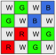
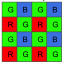
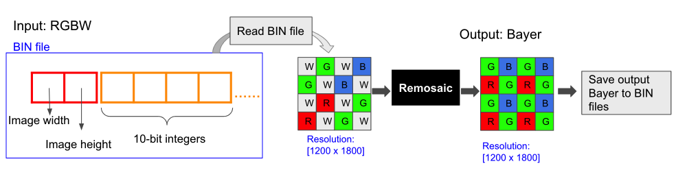
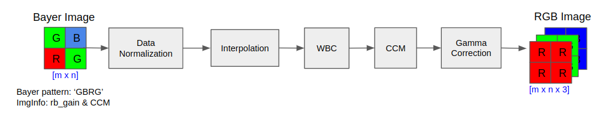

# README
This is a RGBW Joint Remosaic and Denoise (**full-res**) dataset including 70 training pairs of input (RGBW) and ground truth (Bayer), and 15 scenes for the validation and testing dataset. The remosaic task is to interpolate the bayer from input RGBW.


## Overview
All data is hosted on Google Drive, and the training data is shown below:

| Path                                                                                    | Files | Format | Description                                                     | CFA
|:----------------------------------------------------------------------------------------|------:|:------:|:----------------------------------------------------------------| :---------------
| training_dataset_fullres                                                                |       |        | Main folder                                                     |      
| &#9500;&#9472;&nbsp; input                                                              |       |        | Input RGBW dataset <br/> (width, height) = (1800, 1200)         | 
| &nbsp;&nbsp;&nbsp;&nbsp;&nbsp;&nbsp;&#9492;&#9472;&nbsp; train_RGBW_full_input_0dB.zip  |    70 |  .bin  | RGBW input - 0dB Gain                                           |
| &nbsp;&nbsp;&nbsp;&nbsp;&nbsp;&nbsp;&#9492;&#9472;&nbsp; train_RGBW_full_input_24dB.zip |    70 |  .bin  | RGBW input - 24dB Gain                                           |
| &nbsp;&nbsp;&nbsp;&nbsp;&nbsp;&nbsp;&#9492;&#9472;&nbsp; train_RGBW_full_input_42dB.zip |    70 |  .bin  | RGBW input - 42dB Gain                                           |
| &#9500;&#9472;&nbsp; GT_bayer                                                           |       |        | Ground Truth Bayer dataset  <br/> (width, height) = (1800, 1200)| 
| &nbsp;&nbsp;&nbsp;&nbsp;&nbsp;&nbsp;&#9500;&#9472;&nbsp; train_bayer_full_gt.zip        |    70 |  .bin  | GT bayer                                                        |
| &#9500;&#9472;&nbsp; ImgInfo                                                            |       |        |                                                                  |
| &nbsp;&nbsp;&nbsp;&nbsp;&nbsp;&nbsp;&#9500;&#9472;&nbsp; train_RGBW_full_imgInfo.zip    |    70 |  .xml  | Image Information (rb_gain and CCM)                           |
| &#9500;&#9472;&nbsp; thumbnails                                                         |       |        |                                                 |
| &nbsp;&nbsp;&nbsp;&nbsp;&nbsp;&nbsp;&#9500;&#9472;&nbsp; train_RGBW_thumbnail.zip       |    70 |  .png  | Image thumbnails                                                |


Notes: 

1. Each scene in this dataset has one unique ID in the filename to match the input, gt and image info. 
(For example: `rgbw_001_fullres_0db.bin` in the `input` folder matches `rgbw_001_fullres.bin` in the `GT_bayer` folder and `rgbw_001_fullres.xml` in the `ImgInfo` folder)

2. Both the input RGBW and gt bayer are of 10bits.

3. The RGBW and bayer CFA are shown in the table above. 

4. The input RGBW has three different noise levels: 0dB, 24dB, and 42dB, and their corresponding ground truth is the same bayer of 10bits under the GT_bayer folder.

5. The remosaic task is to interpolate the input RGBW at differnt noise levels (dB) to bayer output.

6. The image info under `ImgInfo` provides the r_gain, b_gain and CCM of each scene. They are used to get RGB from bayer for visualization and for estimating certain RGB-based IQ metrics.

7. The images under `thumbnails` provide a quick overview of the scenes in the training dataset.
8. The validation dataset has the same directory structure as the training dataset.

## Dataset

1. Download the training data (70 scenes) [here](https://drive.google.com/drive/folders/18fBySTYlMFC4HO2Tt6j7SFB1BFvu2d01?usp=sharing).
2. Download the validation data (15 scenes) [here](https://drive.google.com/drive/folders/13jnv2_Lh58UAQX0ZuNmOJnRZAKCe5nJk?usp=sharing). 
2. Download the Testing data (15 scenes) [here](https://drive.google.com/drive/folders/1TVJYWF6PJGC47Zkc_nWRMmmSGzJjkDuW?usp=sharing). 
3. RGBW/Bayer data with `.bin` files can be read and written using the Python functions in `data_scripts/`.

    ```bash
    python data_scripts/process_function.py
    ```

## Data process
1. The input RGBW and GT Bayer are raw data of 10bits of the same spatial resolution. 
2. A python script is provided under `data_scipts/` to read and save the raw data of the .bin format. 
3. The first two chars in BIN files are the width and height of the raw image, and the remaining are the image data. 



## Simple ISP
1. A simple ISP to convert bayer image to RGB image is provided under `simple_ISP/`. The pipeline of this ISP shows in the following.



2. Run this Simple ISP.

    ```bash
    python simple_ISP/main.py
    ```

## Contacts

For any questions, please contact

yangqingyu@sensebrain.site<br/>
jiangjun@sensebrain.site<br/>
gujinwei@sensebrain.site<br/>